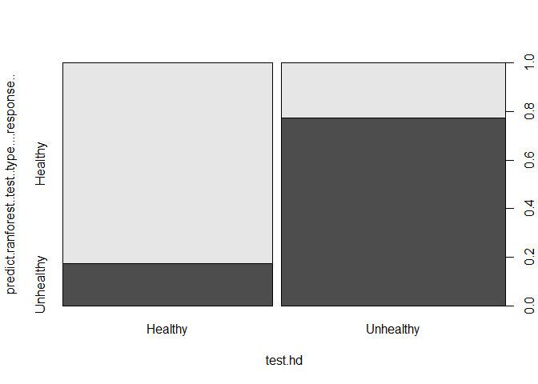

Supervised Machine Learning using Random forest algorithm
================
Joshua Edefo
2024-01-22

Library

``` r
library(randomForest)
```

    ## Warning: package 'randomForest' was built under R version 4.3.2

    ## randomForest 4.7-1.1

    ## Type rfNews() to see new features/changes/bug fixes.

Downloading data from the internet

``` r
url<-"https://archive.ics.uci.edu/ml/machine-learning-databases/heart-disease/processed.cleveland.data"
data<-read.csv(url, header = FALSE)
```

Data cleansing

``` r
head(data)
```

    ##   V1 V2 V3  V4  V5 V6 V7  V8 V9 V10 V11 V12 V13 V14
    ## 1 63  1  1 145 233  1  2 150  0 2.3   3 0.0 6.0   0
    ## 2 67  1  4 160 286  0  2 108  1 1.5   2 3.0 3.0   2
    ## 3 67  1  4 120 229  0  2 129  1 2.6   2 2.0 7.0   1
    ## 4 37  1  3 130 250  0  0 187  0 3.5   3 0.0 3.0   0
    ## 5 41  0  2 130 204  0  2 172  0 1.4   1 0.0 3.0   0
    ## 6 56  1  2 120 236  0  0 178  0 0.8   1 0.0 3.0   0

``` r
# unfortunately no columns are labelled, so we named the column
colnames(data)<-c("age", "sex", "cp", "trestbps", "chol", "fbs", "restecg","thalach", "exang", "oldpeak","slope","ca", "thal","hd")
head(data)
```

    ##   age sex cp trestbps chol fbs restecg thalach exang oldpeak slope  ca thal hd
    ## 1  63   1  1      145  233   1       2     150     0     2.3     3 0.0  6.0  0
    ## 2  67   1  4      160  286   0       2     108     1     1.5     2 3.0  3.0  2
    ## 3  67   1  4      120  229   0       2     129     1     2.6     2 2.0  7.0  1
    ## 4  37   1  3      130  250   0       0     187     0     3.5     3 0.0  3.0  0
    ## 5  41   0  2      130  204   0       2     172     0     1.4     1 0.0  3.0  0
    ## 6  56   1  2      120  236   0       0     178     0     0.8     1 0.0  3.0  0

``` r
# this tells us the 6 rows 0f the data

str(data)
```

    ## 'data.frame':    303 obs. of  14 variables:
    ##  $ age     : num  63 67 67 37 41 56 62 57 63 53 ...
    ##  $ sex     : num  1 1 1 1 0 1 0 0 1 1 ...
    ##  $ cp      : num  1 4 4 3 2 2 4 4 4 4 ...
    ##  $ trestbps: num  145 160 120 130 130 120 140 120 130 140 ...
    ##  $ chol    : num  233 286 229 250 204 236 268 354 254 203 ...
    ##  $ fbs     : num  1 0 0 0 0 0 0 0 0 1 ...
    ##  $ restecg : num  2 2 2 0 2 0 2 0 2 2 ...
    ##  $ thalach : num  150 108 129 187 172 178 160 163 147 155 ...
    ##  $ exang   : num  0 1 1 0 0 0 0 1 0 1 ...
    ##  $ oldpeak : num  2.3 1.5 2.6 3.5 1.4 0.8 3.6 0.6 1.4 3.1 ...
    ##  $ slope   : num  3 2 2 3 1 1 3 1 2 3 ...
    ##  $ ca      : chr  "0.0" "3.0" "2.0" "0.0" ...
    ##  $ thal    : chr  "6.0" "3.0" "7.0" "3.0" ...
    ##  $ hd      : int  0 2 1 0 0 0 3 0 2 1 ...

``` r
# this tells us the structure of the data
# this tells us that some of the columns of the data are messed up  
#e.g sex is supposed to be factor (0=female, 1=male) data, cp(chest pain) also suppose to be factor representing different levels of pain
# ca and thal are correctly called factors but one of the levels is "?" when we need it to be NA
# so got some cleaning to do
# change the ? to n=NA
data[data=="?"] <- NA

# correct the sex values ans change sex to factor
data[data$sex==0,]$sex<-"F"
data[data$sex==1,]$sex<-"M"
data$sex<-as.factor(data$sex)

# convert  a bunch of other columns into factors since that is what they are supposed o be
data$cp <-as.factor(data$cp)
data$fbs <-as.factor(data$fbs)
data$restecg <-as.factor(data$restecg)
data$exang <-as.factor(data$exang)
data$slope <-as.factor(data$slope)

# R thought ca varaible was string whereas it is interger
data$ca <- as.integer(data$ca) # then covert to factor
data$ca <- as.factor(data$ca)

# do likewise for thal
data$thal <- as.integer(data$thal) # then covert to factor
data$thal <- as.factor(data$thal)

# hd 8heart disease) into a factor, using ifelse() to convert the 0s to "Healthy" and the 1s to "Unhealthy"
data$hd <-ifelse(tes = data$hd==0, yes="Healthy", no ="Unhealthy")
data$hd <- as.factor(data$hd)

# check if you have done the corrections
str(data)
```

    ## 'data.frame':    303 obs. of  14 variables:
    ##  $ age     : num  63 67 67 37 41 56 62 57 63 53 ...
    ##  $ sex     : Factor w/ 2 levels "F","M": 2 2 2 2 1 2 1 1 2 2 ...
    ##  $ cp      : Factor w/ 4 levels "1","2","3","4": 1 4 4 3 2 2 4 4 4 4 ...
    ##  $ trestbps: num  145 160 120 130 130 120 140 120 130 140 ...
    ##  $ chol    : num  233 286 229 250 204 236 268 354 254 203 ...
    ##  $ fbs     : Factor w/ 2 levels "0","1": 2 1 1 1 1 1 1 1 1 2 ...
    ##  $ restecg : Factor w/ 3 levels "0","1","2": 3 3 3 1 3 1 3 1 3 3 ...
    ##  $ thalach : num  150 108 129 187 172 178 160 163 147 155 ...
    ##  $ exang   : Factor w/ 2 levels "0","1": 1 2 2 1 1 1 1 2 1 2 ...
    ##  $ oldpeak : num  2.3 1.5 2.6 3.5 1.4 0.8 3.6 0.6 1.4 3.1 ...
    ##  $ slope   : Factor w/ 3 levels "1","2","3": 3 2 2 3 1 1 3 1 2 3 ...
    ##  $ ca      : Factor w/ 4 levels "0","1","2","3": 1 4 3 1 1 1 3 1 2 1 ...
    ##  $ thal    : Factor w/ 3 levels "3","6","7": 2 1 3 1 1 1 1 1 3 3 ...
    ##  $ hd      : Factor w/ 2 levels "Healthy","Unhealthy": 1 2 2 1 1 1 2 1 2 2 ...

``` r
# check for no of rows of data with NA values
nrow(data[is.na(data),]) # 6 rows of data
```

    ## [1] 6

``` r
nrow(data[is.na(data$ca),]) # 4 rows of data from ca variables
```

    ## [1] 4

``` r
nrow(data[is.na(data$thal),]) 
```

    ## [1] 2

``` r
nrow(data[is.na(data$ca) | is.na(data$thal),])
```

    ## [1] 6

``` r
# we can view the missing values
data[is.na(data),] # general
```

    ##      age  sex   cp trestbps chol  fbs restecg thalach exang oldpeak slope   ca
    ## NA    NA <NA> <NA>       NA   NA <NA>    <NA>      NA  <NA>      NA  <NA> <NA>
    ## NA.1  NA <NA> <NA>       NA   NA <NA>    <NA>      NA  <NA>      NA  <NA> <NA>
    ## NA.2  NA <NA> <NA>       NA   NA <NA>    <NA>      NA  <NA>      NA  <NA> <NA>
    ## NA.3  NA <NA> <NA>       NA   NA <NA>    <NA>      NA  <NA>      NA  <NA> <NA>
    ## NA.4  NA <NA> <NA>       NA   NA <NA>    <NA>      NA  <NA>      NA  <NA> <NA>
    ## NA.5  NA <NA> <NA>       NA   NA <NA>    <NA>      NA  <NA>      NA  <NA> <NA>
    ##      thal   hd
    ## NA   <NA> <NA>
    ## NA.1 <NA> <NA>
    ## NA.2 <NA> <NA>
    ## NA.3 <NA> <NA>
    ## NA.4 <NA> <NA>
    ## NA.5 <NA> <NA>

``` r
data[is.na(data$ca) | is.na(data$thal),]
```

    ##     age sex cp trestbps chol fbs restecg thalach exang oldpeak slope   ca thal
    ## 88   53   F  3      128  216   0       2     115     0     0.0     1    0 <NA>
    ## 167  52   M  3      138  223   0       0     169     0     0.0     1 <NA>    3
    ## 193  43   M  4      132  247   1       2     143     1     0.1     2 <NA>    7
    ## 267  52   M  4      128  204   1       0     156     1     1.0     2    0 <NA>
    ## 288  58   M  2      125  220   0       0     144     0     0.4     2 <NA>    7
    ## 303  38   M  3      138  175   0       0     173     0     0.0     1 <NA>    3
    ##            hd
    ## 88    Healthy
    ## 167   Healthy
    ## 193 Unhealthy
    ## 267 Unhealthy
    ## 288   Healthy
    ## 303   Healthy

``` r
nrow(data)
```

    ## [1] 303

``` r
# use delete wise
data<-na.omit(data)
nrow(data)
```

    ## [1] 297

``` r
# we need to make sure that healthy and diseased samples comes from each gender, 
# if only male samples have heart disease, we should probably remove all femeles from the model
xtabs(~hd + sex, data=data)
```

    ##            sex
    ## hd            F   M
    ##   Healthy    71  89
    ##   Unhealthy  25 112

``` r
# now let's cerify that all 4 levels of chest pain (cp) were reported for by bunch of patients
xtabs(~hd + cp, data=data)
```

    ##            cp
    ## hd            1   2   3   4
    ##   Healthy    16  40  65  39
    ##   Unhealthy   7   9  18 103

``` r
# and then we do the same thing for all of the boolean and categorical variables that we are using to predict heart disease
xtabs(~hd + fbs, data=data)
```

    ##            fbs
    ## hd            0   1
    ##   Healthy   137  23
    ##   Unhealthy 117  20

``` r
xtabs(~hd + restecg, data=data) # only 4 patients represent level 1. This could, potentially, get in the way of finding the best fitting line.
```

    ##            restecg
    ## hd           0  1  2
    ##   Healthy   92  1 67
    ##   Unhealthy 55  3 79

``` r
#however, for now we will just leave it in and use it to see what happens
xtabs(~hd + exang, data=data)
```

    ##            exang
    ## hd            0   1
    ##   Healthy   137  23
    ##   Unhealthy  63  74

``` r
xtabs(~hd + slope, data=data)
```

    ##            slope
    ## hd            1   2   3
    ##   Healthy   103  48   9
    ##   Unhealthy  36  89  12

``` r
xtabs(~hd + ca, data=data)
```

    ##            ca
    ## hd            0   1   2   3
    ##   Healthy   129  21   7   3
    ##   Unhealthy  45  44  31  17

``` r
xtabs(~hd + thal, data=data)
```

    ##            thal
    ## hd            3   6   7
    ##   Healthy   127   6  27
    ##   Unhealthy  37  12  88

Dataset spliting

``` r
split<-floor(nrow(data)*0.8)
# 80 % for train data and 20% for test data
Index<-sample(1:nrow(data), size= split)
train<-data[Index,]
str(train)
```

    ## 'data.frame':    237 obs. of  14 variables:
    ##  $ age     : num  56 43 41 55 60 57 51 46 69 61 ...
    ##  $ sex     : Factor w/ 2 levels "F","M": 2 1 2 1 2 1 1 1 2 2 ...
    ##  $ cp      : Factor w/ 4 levels "1","2","3","4": 3 4 4 2 4 4 4 4 3 3 ...
    ##  $ trestbps: num  130 132 110 135 140 140 130 138 140 150 ...
    ##  $ chol    : num  256 341 172 250 293 241 305 243 254 243 ...
    ##  $ fbs     : Factor w/ 2 levels "0","1": 2 2 1 1 1 1 1 1 1 2 ...
    ##  $ restecg : Factor w/ 3 levels "0","1","2": 3 3 3 3 3 1 1 3 3 1 ...
    ##  $ thalach : num  142 136 158 161 170 123 142 152 146 137 ...
    ##  $ exang   : Factor w/ 2 levels "0","1": 2 2 1 1 1 2 2 2 1 2 ...
    ##  $ oldpeak : num  0.6 3 0 1.4 1.2 0.2 1.2 0 2 1 ...
    ##  $ slope   : Factor w/ 3 levels "1","2","3": 2 2 1 2 2 2 2 2 2 2 ...
    ##  $ ca      : Factor w/ 4 levels "0","1","2","3": 2 1 1 1 3 1 1 1 4 1 ...
    ##  $ thal    : Factor w/ 3 levels "3","6","7": 2 3 3 1 3 3 3 1 3 1 ...
    ##  $ hd      : Factor w/ 2 levels "Healthy","Unhealthy": 2 2 2 1 2 2 2 1 2 1 ...
    ##  - attr(*, "na.action")= 'omit' Named int [1:6] 88 167 193 267 288 303
    ##   ..- attr(*, "names")= chr [1:6] "88" "167" "193" "267" ...

``` r
test<-data[-Index,]
str(test)
```

    ## 'data.frame':    60 obs. of  14 variables:
    ##  $ age     : num  56 62 56 44 48 40 69 59 40 58 ...
    ##  $ sex     : Factor w/ 2 levels "F","M": 2 1 1 2 2 2 1 2 2 2 ...
    ##  $ cp      : Factor w/ 4 levels "1","2","3","4": 2 4 2 2 2 4 1 4 1 3 ...
    ##  $ trestbps: num  120 140 140 120 110 110 140 135 140 112 ...
    ##  $ chol    : num  236 268 294 263 229 167 239 234 199 230 ...
    ##  $ fbs     : Factor w/ 2 levels "0","1": 1 1 1 1 1 1 1 1 1 1 ...
    ##  $ restecg : Factor w/ 3 levels "0","1","2": 1 3 3 1 1 3 1 1 1 3 ...
    ##  $ thalach : num  178 160 153 173 168 114 151 161 178 165 ...
    ##  $ exang   : Factor w/ 2 levels "0","1": 1 1 1 1 1 2 1 1 2 1 ...
    ##  $ oldpeak : num  0.8 3.6 1.3 0 1 2 1.8 0.5 1.4 2.5 ...
    ##  $ slope   : Factor w/ 3 levels "1","2","3": 1 3 2 1 3 2 1 2 1 2 ...
    ##  $ ca      : Factor w/ 4 levels "0","1","2","3": 1 3 1 1 1 1 3 1 1 2 ...
    ##  $ thal    : Factor w/ 3 levels "3","6","7": 1 1 1 3 3 3 1 3 3 3 ...
    ##  $ hd      : Factor w/ 2 levels "Healthy","Unhealthy": 1 2 1 1 2 2 1 1 1 2 ...
    ##  - attr(*, "na.action")= 'omit' Named int [1:6] 88 167 193 267 288 303
    ##   ..- attr(*, "names")= chr [1:6] "88" "167" "193" "267" ...

Build Random forest model

``` r
ranforest<- randomForest(hd~., data= train, mtry=4, ntree=2001, importance= TRUE)
ranforest
```

    ## 
    ## Call:
    ##  randomForest(formula = hd ~ ., data = train, mtry = 4, ntree = 2001,      importance = TRUE) 
    ##                Type of random forest: classification
    ##                      Number of trees: 2001
    ## No. of variables tried at each split: 4
    ## 
    ##         OOB estimate of  error rate: 17.3%
    ## Confusion matrix:
    ##           Healthy Unhealthy class.error
    ## Healthy       115        16   0.1221374
    ## Unhealthy      25        81   0.2358491

Use the model as a predictive tool and validate the model

``` r
result_= data.frame(test$hd, predict(ranforest, test, type="response"))
result_
```

    ##       test.hd predict.ranforest..test..type....response..
    ## 6     Healthy                                     Healthy
    ## 7   Unhealthy                                   Unhealthy
    ## 12    Healthy                                     Healthy
    ## 14    Healthy                                     Healthy
    ## 17  Unhealthy                                     Healthy
    ## 30  Unhealthy                                   Unhealthy
    ## 31    Healthy                                     Healthy
    ## 34    Healthy                                   Unhealthy
    ## 42    Healthy                                     Healthy
    ## 46  Unhealthy                                   Unhealthy
    ## 47    Healthy                                     Healthy
    ## 53  Unhealthy                                   Unhealthy
    ## 59    Healthy                                     Healthy
    ## 65  Unhealthy                                   Unhealthy
    ## 69  Unhealthy                                   Unhealthy
    ## 74  Unhealthy                                   Unhealthy
    ## 81    Healthy                                   Unhealthy
    ## 82    Healthy                                     Healthy
    ## 86    Healthy                                     Healthy
    ## 87    Healthy                                     Healthy
    ## 91    Healthy                                     Healthy
    ## 100   Healthy                                     Healthy
    ## 111 Unhealthy                                   Unhealthy
    ## 118   Healthy                                     Healthy
    ## 122 Unhealthy                                   Unhealthy
    ## 124 Unhealthy                                   Unhealthy
    ## 125 Unhealthy                                     Healthy
    ## 137 Unhealthy                                   Unhealthy
    ## 139 Unhealthy                                   Unhealthy
    ## 140   Healthy                                     Healthy
    ## 142 Unhealthy                                     Healthy
    ## 146 Unhealthy                                     Healthy
    ## 147 Unhealthy                                   Unhealthy
    ## 149   Healthy                                     Healthy
    ## 155 Unhealthy                                   Unhealthy
    ## 162 Unhealthy                                   Unhealthy
    ## 165   Healthy                                     Healthy
    ## 172   Healthy                                   Unhealthy
    ## 174   Healthy                                   Unhealthy
    ## 176 Unhealthy                                   Unhealthy
    ## 178 Unhealthy                                   Unhealthy
    ## 179   Healthy                                     Healthy
    ## 189 Unhealthy                                     Healthy
    ## 191   Healthy                                     Healthy
    ## 196 Unhealthy                                   Unhealthy
    ## 206 Unhealthy                                   Unhealthy
    ## 207 Unhealthy                                   Unhealthy
    ## 209   Healthy                                     Healthy
    ## 212 Unhealthy                                     Healthy
    ## 216   Healthy                                     Healthy
    ## 221   Healthy                                     Healthy
    ## 251   Healthy                                   Unhealthy
    ## 254   Healthy                                     Healthy
    ## 259   Healthy                                     Healthy
    ## 266 Unhealthy                                   Unhealthy
    ## 271 Unhealthy                                   Unhealthy
    ## 280   Healthy                                     Healthy
    ## 285 Unhealthy                                   Unhealthy
    ## 291 Unhealthy                                     Healthy
    ## 297 Unhealthy                                   Unhealthy

``` r
plot(result_)
```

<!-- -->

Session information

``` r
sessionInfo()
```

    ## R version 4.3.1 (2023-06-16 ucrt)
    ## Platform: x86_64-w64-mingw32/x64 (64-bit)
    ## Running under: Windows 11 x64 (build 22631)
    ## 
    ## Matrix products: default
    ## 
    ## 
    ## locale:
    ## [1] LC_COLLATE=English_United Kingdom.utf8 
    ## [2] LC_CTYPE=English_United Kingdom.utf8   
    ## [3] LC_MONETARY=English_United Kingdom.utf8
    ## [4] LC_NUMERIC=C                           
    ## [5] LC_TIME=English_United Kingdom.utf8    
    ## 
    ## time zone: Europe/London
    ## tzcode source: internal
    ## 
    ## attached base packages:
    ## [1] stats     graphics  grDevices utils     datasets  methods   base     
    ## 
    ## other attached packages:
    ## [1] randomForest_4.7-1.1
    ## 
    ## loaded via a namespace (and not attached):
    ##  [1] compiler_4.3.1    fastmap_1.1.1     cli_3.6.1         tools_4.3.1      
    ##  [5] htmltools_0.5.6   rstudioapi_0.15.0 yaml_2.3.7        rmarkdown_2.25   
    ##  [9] knitr_1.44        xfun_0.40         digest_0.6.33     rlang_1.1.1      
    ## [13] evaluate_0.21
